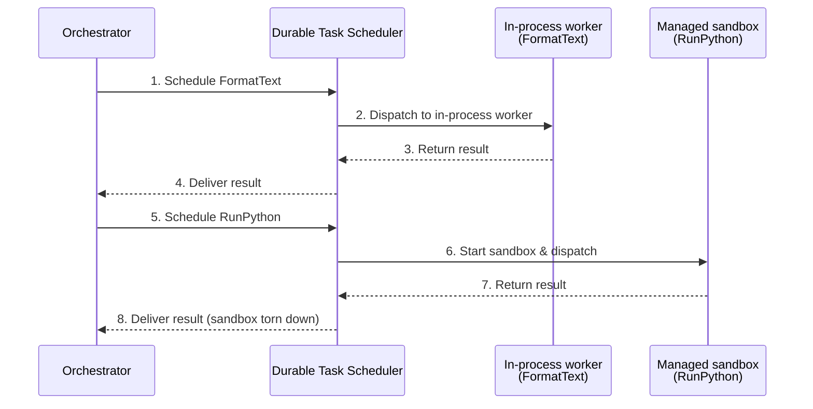

# On-demand Sandboxes for Azure Durable Task Scheduler

> **Status:** Private preview

> [!WARNING]
> This is a preview feature. It is provided for evaluation purposes only and is
> not intended or supported for production use. Functionality, APIs, and
> behavior may change before general availability.

> [!NOTE]
> This feature is only available on schedulers in the following regions:
>
> - East US 2 (`eastus2`)
> - West US 3 (`westus3`)
> - North Europe (`northeurope`)
> - Australia East (`australiaeast`)

## Overview

A *sandbox* is an isolated, microVM-backed container that runs a single piece of your
workflow with its own runtime, dependencies, and security boundary—separate from your
orchestrator's process.

On-demand Sandboxes let you move individual workflow steps (activities) out of your
orchestrator process and into managed, isolated compute, while your orchestrator stays
exactly where it is. You tell Durable Task Scheduler (DTS) which activities should run
in isolation and provide a container image with that activity code; DTS handles
provisioning, scaling, and teardown.

Most activities belong in-process: they're fast, simple, and co-located with your
orchestrator. But some steps don't fit that model—they need a native binary, a
different language runtime, per-invocation isolation, or bursty compute you don't want
to keep warm. On-demand Sandboxes handle those exceptions without dedicated
infrastructure or custom scaling policies.

## Why it's valuable

- **Activity-level granularity.** Move individual steps to managed compute, not your
  whole app.
- **Per-activity or per-invocation isolation.** Each execution runs in a clean,
  microVM-backed sandbox—ideal for untrusted code, customer plugins, or LLM-generated
  logic.
- **Cross-runtime flexibility.** Run a Python inference step from a .NET orchestrator,
  with no compromise on either side.
- **Scale-to-zero.** Pay for CPU and memory per second of execution, not for
  infrastructure that sits idle.
- **No orchestrator changes.** Your orchestration code and hosting model don't change
  at all.

## Who this is for

This guide works for two kinds of users:

- **New to Durable Task Scheduler.** You don't have an app, orchestration, or scheduler
  yet. Follow the prerequisites below to provision a scheduler and stand up an
  orchestrator app, then add a sandbox worker profile from the start.
- **Migrating an existing orchestration.** You already have an app, an orchestration, and
  a provisioned scheduler. You don't rewrite your orchestration—you pick the activities
  you want to isolate, move their implementations into a worker image, and declare a
  sandbox worker profile for them. Your orchestrator keeps calling those activities
  exactly as before.

Either way, the orchestrator code and hosting model don't change. On-demand Sandboxes are
additive: you opt specific activities into managed isolation through profile
configuration.

## Prerequisites

Before you begin, make sure you have the following. Items marked **(new users)** are
things you set up if you're starting from scratch; if you're migrating an existing app
you likely already have them.

- **Private preview access.** On-demand Sandboxes is in private preview.
  [Sign up here](https://techcommunity.microsoft.com/blog/AppsonAzureBlog/introducing-on-demand-sandboxes-for-azure-durable-task-scheduler-private-preview/4522333)
  to have the feature enabled on your scheduler.
- **An app using a supported standalone Durable Task SDK.** *(new users)* On-demand
  Sandboxes target the standalone Durable Task SDKs used *outside* the Azure Functions
  host—apps running on Azure Container Apps, Azure Kubernetes Service, App Service, or
  anywhere else you self-host. The private preview supports the **.NET** and **Python**
  SDKs; additional language SDKs and Azure Functions support are coming soon. If you're
  migrating, this is your existing orchestrator app.
- **A provisioned Durable Task Scheduler** configured as the durable backend for your
  app. *(new users)* If you're migrating, this is your existing scheduler—just make sure
  the feature is enabled on it (see private preview access above) and that it's in one of
  the supported regions listed at the top of this page.
- **A container registry** (for example, Azure Container Registry) where you can push
  the worker image that contains your sandboxed activity code.
- **User-assigned managed identities** that DTS uses to pull your worker image from your
  container registry and start the sandbox. The scheduler must be assigned an identity
  that has the **AcrPull** role on your registry, and you provide the identity client IDs
  on the worker profile (`image_pull_managed_identity_client_id` and
  `scheduler_managed_identity_client_id`). See
  [Configure the scheduler identity for image pull](#configure-the-scheduler-identity-for-image-pull).

## How it works

On-demand Sandboxes use a two-part model:

1. A **sandbox worker profile** in your orchestrator app that tells DTS which activities
   to offload.
2. A **worker image** that contains those activity implementations.

Your orchestrator still calls activities the same way it always has. The decision to run
an activity in a sandbox lives entirely in the profile configuration.

### A simple example

Imagine an orchestrator that does two things: format some text in-process, then run a
piece of customer-supplied Python in isolation. Only the second activity is declared in a
sandbox worker profile, so DTS runs it in a managed sandbox started from your worker
image—while the first activity stays in-process. The result flows back to the
orchestrator as if nothing special happened.



The orchestrator never calls an activity directly—it always schedules the work through
DTS, and DTS dispatches it to a worker. The only difference is which worker runs it:

1. **FormatText (in-process).** The orchestrator schedules it (step 1), DTS dispatches it
   to the in-process worker in your app (step 2), and the result flows back through DTS
   (steps 3–4).
2. **RunPython (sandboxed).** Because it's declared in a sandbox worker profile, DTS
   starts a sandbox from your worker image and dispatches the activity to it (steps 5–6).
   The result flows back through DTS (steps 7–8), and DTS tears the sandbox down when the
   work is done.

## Configure the scheduler identity for image pull

To start a sandbox, DTS pulls your worker image from your container registry on your
behalf. It does this using a **user-assigned managed identity** attached to the scheduler.
That identity must be granted the **AcrPull** role on the Azure Container Registry that
hosts your worker image, and the scheduler must have the identity attached.

> [!IMPORTANT]
> Only **user-assigned** managed identities are supported. System-assigned managed
> identities are not supported at this time.

The worker profile distinguishes two identities, and you can use the same identity for
both or split them:

- **Image-pull identity** (`image_pull_managed_identity_client_id` /
  `ImagePullManagedIdentityClientId`) — the identity DTS uses to **pull the worker image**
  from your registry. This identity needs the **AcrPull** role on the registry.
- **Worker/scheduler identity** (`scheduler_managed_identity_client_id` /
  `SchedulerManagedIdentityClientId`) — the identity the **sandbox worker uses to connect
  back to Durable Task Scheduler**, and the identity your activity code runs as when it
  calls other services (for example, Storage, Key Vault, or a database). Grant this
  identity whatever roles your activity code needs on those downstream services.

Both identities must be attached to the scheduler. Using two separate identities lets you
scope image-pull permissions narrowly while granting your activity code only the
downstream permissions it needs.

### 1. Grant the identity the AcrPull role on your registry

Assign the **AcrPull** role to the **image-pull** user-assigned managed identity, scoped
to your registry:

```bash
az role assignment create \
  --assignee "<image-pull-identity-principal-id>" \
  --role "AcrPull" \
  --scope "/subscriptions/<subscription-id>/resourceGroups/<resource-group>/providers/Microsoft.ContainerRegistry/registries/<registry-name>"
```

Without this role assignment, DTS cannot pull the worker image and the sandbox will fail
to start. If your activity code calls other Azure services, grant the **worker/scheduler**
identity the roles it needs on those services as well.

### 2. Attach the identity to the scheduler

The scheduler must have the user-assigned identity attached. You can attach it when you
create the scheduler, or update an existing scheduler.

> [!IMPORTANT]
> Managing scheduler identities requires API version **2026-05-01-preview** or later. See
> the [Schedulers - Create Or Update](https://learn.microsoft.com/rest/api/durabletask/schedulers/create-or-update?view=rest-durabletask-2026-05-01-preview&tabs=HTTP#managedserviceidentity)
> REST API reference.

**For an existing scheduler**, send a PATCH to the scheduler resource URI. You can attach
multiple identities:

```bash
az rest --method patch \
  --uri "https://management.azure.com/subscriptions/<subscription-id>/resourceGroups/<resource-group>/providers/Microsoft.DurableTask/schedulers/<scheduler-name>?api-version=2026-05-01-preview" \
  --body '{
    "identity": {
      "type": "UserAssigned",
      "userAssignedIdentities": {
        "/subscriptions/<subscription-id>/resourceGroups/<resource-group>/providers/Microsoft.ManagedIdentity/userAssignedIdentities/<identity-name>": {}
      }
    }
  }'
```

You can also include the same `identity` block directly in the body when **creating** a
scheduler.

**To remove a specific identity**, PATCH with that identity's value set explicitly to
`null`:

```json
{
  "identity": {
    "type": "UserAssigned",
    "userAssignedIdentities": {
      "/subscriptions/<subscription-id>/resourceGroups/<resource-group>/providers/Microsoft.ManagedIdentity/userAssignedIdentities/<identity-name>": null
    }
  }
}
```

**To turn off user-assigned identities entirely**, set the identity type to `None`:

```json
{
  "identity": {
    "type": "None"
  }
}
```

Once the identities are attached to the scheduler\u2014the image-pull identity with the
**AcrPull** role on your registry\u2014reference their client IDs on the worker profile
(`image_pull_managed_identity_client_id` and `scheduler_managed_identity_client_id`) so
DTS uses the image-pull identity to pull the image and the worker/scheduler identity for
the sandbox worker to connect back to DTS and call downstream services.

## Choose your language

Follow the step-by-step guide for your SDK:

- **[.NET guide](./dotnet.md)** — declare a sandbox worker profile and build the worker
  image with the .NET Durable Task SDK.
- **[Python guide](./python.md)** — declare a sandbox worker profile and build the worker
  image with the Python Durable Task SDK.

Both guides follow the same shape: declare a sandbox worker profile in your orchestrator
app, build and push a worker image, then view execution logs in the DTS dashboard.

## Worker profile configuration reference

Both languages configure the same worker profile settings. The table below lists each
setting, what it controls, its accepted values, and its default. The setting names differ
slightly between .NET (`PascalCase`) and Python (`snake_case`) but map one to one.

| Setting (.NET / Python) | What it controls | Accepted values | Default |
| --- | --- | --- | --- |
| `ContainerImage` / `container_image` | The container image that holds your activity implementations. | A full OCI image reference, by tag (`myregistry.azurecr.io/workers/hello:1.0`) or digest (`myregistry.azurecr.io/workers/hello@sha256:...`). | *Required* |
| `ImagePullManagedIdentityClientId` / `image_pull_managed_identity_client_id` | The client ID of the user-assigned managed identity DTS uses to **pull the worker image** from your registry. This identity needs the **AcrPull** role on the registry. | A user-assigned managed identity client ID (GUID). Must be attached to the scheduler. | *Required* |
| `SchedulerManagedIdentityClientId` / `scheduler_managed_identity_client_id` | The client ID of the user-assigned managed identity the **sandbox worker uses to connect back to DTS**, and that the activity code runs as when calling other services. | A user-assigned managed identity client ID (GUID). Must be attached to the scheduler. Can be the same identity as the image-pull identity or a different one. | *Required* |
| `Cpu` / `cpu` | CPU quantity declared for each sandbox. | A positive CPU quantity, expressed in millicores (`500m`, `1000m`) or whole/fractional cores (`2`, `0.5`). | `1000m` (1 vCPU) |
| `Memory` / `memory` | Memory quantity declared for each sandbox. | A positive memory quantity, such as `256Mi`, `1Gi`, or a bare number interpreted as MiB (`2048`). | `2048Mi` |
| `MaxConcurrentActivities` / `max_concurrent_activities` | How many activities a single sandbox worker instance processes concurrently. | An integer greater than `0`. There is no enforced upper bound; size it to what your activity and resource shape can handle. | `100` |
| `EnvironmentVariables` / `environment_variables` | Customer environment variables injected into the sandbox at runtime. | A map of string keys to string values. | Empty |
| *(profile id)* | Friendly profile id that groups the image, resources, and activities for monitoring and reuse. | A non-empty string, unique across your declared profiles. | `default` |
| `AddActivity` / `add_activity` | The activity names this profile offloads to the sandbox. | One or more activity names. At least one is required; an activity can belong to only one profile. | *Required* |

> [!NOTE]
> CPU and memory must be positive resource quantities. The platform may apply additional
> per-preview ceilings on the total CPU and memory a sandbox can request—check your
> private preview onboarding details for the current limits.

## View logs in the DTS dashboard

Once your sandbox activities are running, you can view their execution logs directly in
the Durable Task Scheduler dashboard. The dashboard shows real-time output from your
managed workers, including stdout, stderr, and activity lifecycle events—giving you full
visibility into what's happening inside the sandbox without configuring external log
sinks or building your own observability pipeline.

## Get started

On-demand Sandboxes is in private preview. To get access,
[sign up here](https://techcommunity.microsoft.com/blog/AppsonAzureBlog/introducing-on-demand-sandboxes-for-azure-durable-task-scheduler-private-preview/4522333).
Once you're in, the workflow is straightforward: declare a sandbox worker profile in
your orchestrator app, build and push a worker image, and DTS takes care of the rest.

## Related resources

- **Documentation:** [Durable Task Scheduler overview](https://learn.microsoft.com/azure/durable-task/)
- **Samples:** [Azure-Samples/Durable-Task-Scheduler](https://github.com/Azure-Samples/Durable-Task-Scheduler)
  · Python end-to-end sample: [`examples/on_demand_sandbox`](https://github.com/microsoft/durabletask-python/tree/main/examples/on_demand_sandbox)
- **Pricing:** [Azure Durable Task Scheduler pricing](https://azure.microsoft.com/pricing/)
- **Feedback:** Open an issue in the
  [Durable-Task-Scheduler GitHub repo](https://github.com/Azure-Samples/Durable-Task-Scheduler).
